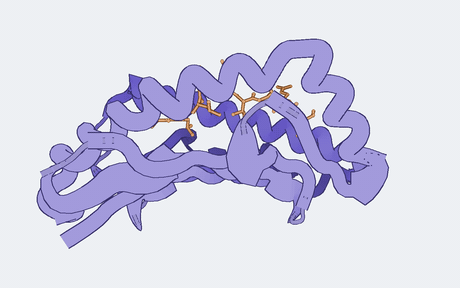
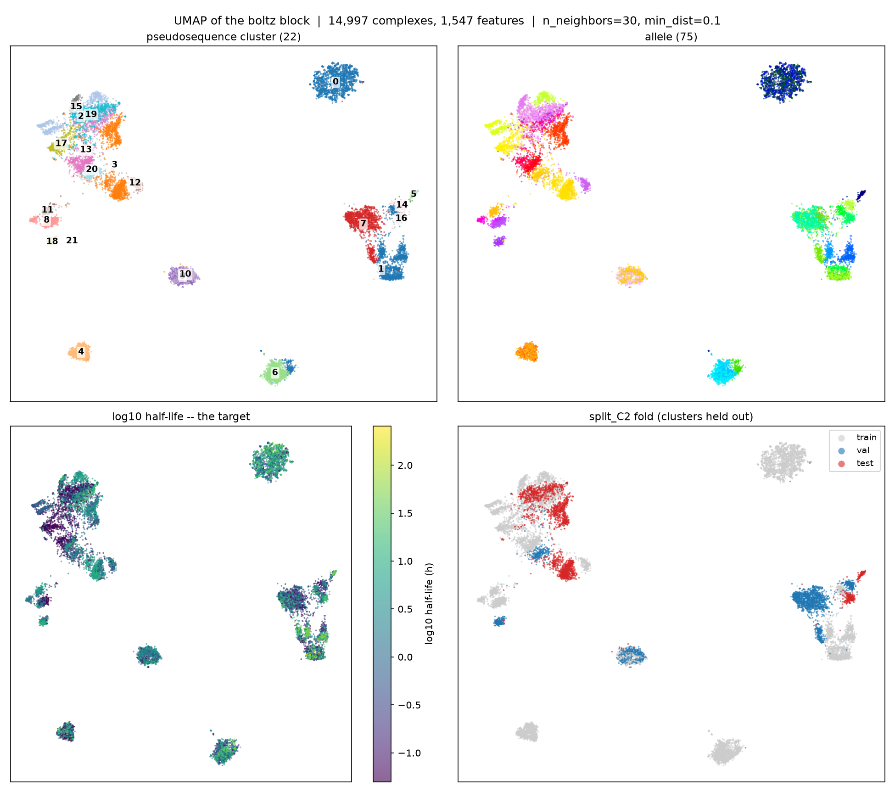
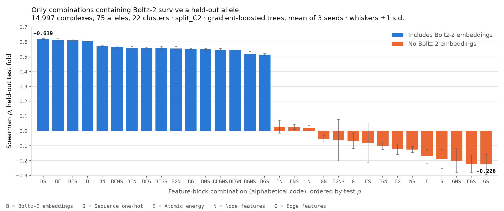

# Boltz-τ: HLA–Peptide Stability from Foundational Protein Embeddings

Boltz-τ is a lightweight half-life predictor for peptide–HLA class I complexes.
It keeps Boltz-2 frozen and trains a shallow MLP readout to map its structural
embeddings to measured binding stability—how long a peptide remains bound before
it dissociates.

  <a href="https://joehart2001.github.io/boltz-tau/">
    <picture>
      <source media="(prefers-color-scheme: dark)" srcset="demo_app_html/docs/protein.gif">
      
    </picture>
  </a>

  <a href="https://joehart2001.github.io/boltz-tau/"><strong>▶&nbsp; Watch the interactive demo</strong></a> 
  Five scenes, 68 s. Sequence baselines, transferred Boltz-2 embeddings,
  held-out results, and the MACE extension. Scrub it, or jump to any scene.

  <em>Above: HLA-A*02:01 with <code>ALLENIHRV</code> in the groove — the real Boltz-2
  prediction, t½ 44.7 h, complex pLDDT 0.988.</em>

This repository first splits peptide-allele information using several clustering schemes, the first being a random 

  <picture>
    <source media="(prefers-color-scheme: dark)" srcset="workflow/umap_energy/fig_umap_boltz.png">
    
  </picture>

  <em>UMAP of allele structure configurations generated from Boltz-2 (https://github.com/jwohlwend/boltz) architecture </em>

**The shallow readout on frozen Boltz-2 complex embeddings beats every
from-scratch sequence model, and the margin grows with how hard the split is.**
On the cluster split, where no groove group leaks between train and test, every
sequence model goes negative while the Boltz-τ readout remains predictive.

  <picture>
    <source media="(prefers-color-scheme: dark)" srcset="mlp-embeds/figs/compare/final_test_metrics.png">
    
  </picture>

  <em>Graph comparing performance of each model on Pearson correlation across alleles and Spearman correlation within individual alleles. Dashed line indicates reference state-of-the-art methods performed on splits by peptide from Rasmussen et. al (2016).</em>

| split label | held out | direct (MLP) | transformer | SE+MLP | SE+XGB | **boltz2 (frozen)** |
|---|---|---|---|---|---|---|
| A | nothing (shuffled) | 0.728 | 0.634 | 0.749 | 0.741 | **0.794** |
| B | peptides | 0.696 | 0.596 | 0.712 | 0.729 | **0.761** |
| C | alleles | 0.570 | 0.375 | 0.592 | 0.487 | **0.714** |
| C2 | allele clusters | −0.065 | −0.098 | −0.108 | −0.075 | **0.425** |

Pearson r on held-out test, ~14,500 embedded rows spanning 75 alleles and
22 clusters. Full table in `mlp-embeds/figs/compare/summary_test_metrics.md`.
C2 puts about 3 of its 22 clusters in test, so read that row as a spread rather
than a point value.

The lightweight architectures are comparable to the reference MINT methods on
random and peptide-held-out partitions. The sequence-only models do not
generalise to unseen alleles or allele groups; the shallow MLP trained on frozen
Boltz-2 embeddings does. This also shows why a peptide-only holdout is not enough
to measure generalisation across HLA structures.

We also report the inter-allele Spearman correlation, which measures how well the models actually learned the peptide's influence on the lifetime as opposed to reading out exclusively for given allele types. This also shows a significant decline in correlation values, suggesting that further works need to consider these individual-allele benchmarks to truly evaluate the peptide learning task.

## Repository structure

From the above table and graph, we can see that of all the lighter archictectures perform at a level comparable to the current state-of-the-art MINT methods on random and peptide-excluded data partitioning. However, these lighter models fail to generalize to allele structures, with catastrophic failure when a completely unseen allele structure group is introduced, with the exception of the Boltz-2 embedded model. The reference value comes from an exclude-peptide-type splitting, which we also show is not sufficient to generalize structure predictions to different alleles.

We also report the inter-allele Spearman correlation, which measures how well the models actually learned the peptide's influence on the lifetime as opposed to reading out exclusively for given allele types. This also shows a significant decline in correlation values, suggesting that further works need to consider these individual-allele benchmarks to truly evaluate the peptide learning task.

### Extension to MACE architecture
We also try a one-shot attempt to use the MACE-OFF (https://github.com/ACEsuit/mace-off) machine-learned interatomic potential on the Boltz-2 structure outputs. However, due to time and resource constraints, we were unable to run larger simulations which include electrostatics and the solvated environment, leading to no significant improvement from the MACE readouts.

  <picture>
    <source media="(prefers-color-scheme: dark)" srcset="mace-peptide.png">
    
  </picture>

  <em>Bar graph of spearman correlation including various MACE and Boltz-2 readouts. Note that including only MACE embeddings generally leads to worse results, likely due to the inability to include solvated environment static effects. </em>

Further work could use MACE's enriched descriptor basis from a more realistic structure to enhance accuracy.

## Repository structure

- **`mlp-embeds/`** — the models: four `*-network/` frameworks (direct,
  transformer, squeeze-boost, boltz) sharing flat modules, plus a cross-network
  comparison harness in `mlp-embeds/figs/`. See `mlp-embeds/README.md`.
- **`Data/`** — dataset, precomputed splits, and Boltz2 embeddings (embeddings gitignored here due to file size constraints).
- **`demo_app_html/`** — the demo above, plus the structure pipeline explainer
  and the renderer behind the rotating complex. Each builds to one
  dependency-free HTML file; published to [Pages](https://joehart2001.github.io/boltz-tau/) by
  `.github/workflows/pages.yml`, which gates the deploy on the build checks.
  See `demo_app_html/README.md`.

## References

### Dataset
- Rasmussen M, Fenoy E, Harndahl M, Kristensen AB, Nielsen IK, Nielsen M, Buus S.
  **Pan-Specific Prediction of Peptide–MHC Class I Complex Stability, a Correlate
  of T Cell Immunogenicity.** *The Journal of Immunology.* 2016;197(4):1517–1524.
  doi:[10.4049/jimmunol.1600582](https://doi.org/10.4049/jimmunol.1600582) ·
  [PubMed](https://pubmed.ncbi.nlm.nih.gov/27402703/)
  — source of the `rasmussen_et_al_dataset.csv` stability measurements and the
  NetMHCstabpan method (pan-specific PCC = 0.676, global rescaling).

### Other methods cited for context (binding *affinity*, not stability)
- Reynisson B, Alvarez B, Paul S, Peters B, Nielsen M. **NetMHCpan-4.1 / NetMHCIIpan-4.0.**
  *Nucleic Acids Research.* 2020;48(W1):W449–W454.
  doi:[10.1093/nar/gkaa379](https://doi.org/10.1093/nar/gkaa379) — affinity Pearson r ≈ 0.78–0.82.
- O'Donnell TJ, Rubinsteyn A, Laserson U. **MHCflurry 2.0.** *Cell Systems.*
  2020;11(1):42–48. doi:[10.1016/j.cels.2020.06.010](https://doi.org/10.1016/j.cels.2020.06.010)
  — affinity Pearson r ≈ 0.76–0.80.
- Chu Y, et al. **TransPHLA (a transformer-based method for pMHC binding, Zhao et al.).**
  *Nature Machine Intelligence.* 2021. — epitope classification AUC ≈ 0.93–0.96.

> Note: affinity (KD/IC50) is a different, less kinetically noisy target than
> stability; those numbers are context only and are **not** used as reference
> lines. The reference lines are the stability-specific values from the dataset.
